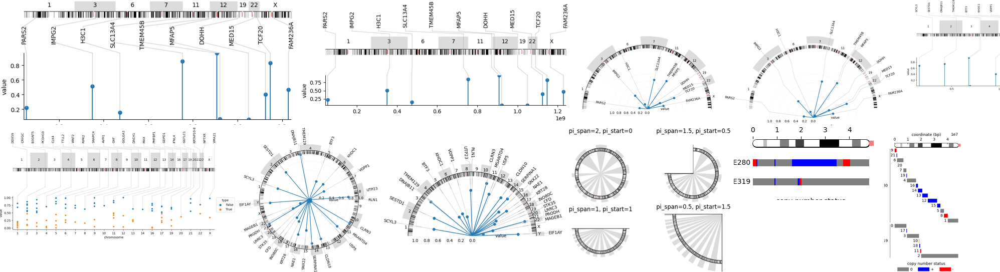

<!-- PROJECT SHIELDS -->
<div align="center">
  
<!-- [![Contributors][contributors-shield]][contributors-url]
[![Forks][forks-shield]][forks-url]
[![Stargazers][stars-shield]][stars-url] -->
<a href="">[](https://pypi.org/project/chrov)</a>
<a href="">[](https://github.com/rraadd88/chrov/actions/workflows/build.yml)</a>
<a href="">[](https://github.com/rraadd88/chrov/issues)</a>
<br />
<a href="">[](https://pepy.tech/project/chrov)</a>
<a href="">[](https://github.com/rraadd88/chrov/blob/master/LICENSE)</a>
</div>
  
<!-- PROJECT LOGO -->
<div align="center">
  
  <h1 align="center">chrov</h1>
  <p align="center">
    Chromosome Visualization library in python.
    <br />
    <a href="https://github.com/rraadd88/chrov#examples">Examples</a>
    ·
    <a href="https://github.com/rraadd88/chrov#api">Explore the API</a>
  </p>
</div>  

   

# Examples  

[🏷️Annotations on chromosomes](https://github.com/rraadd88/chrov/blob/master/examples/chrov_viz_annot.ipynb)  
[🧬Visualization of genome, set of chromosomes, a chromosome and an arm](https://github.com/rraadd88/chrov/blob/master/examples/chrov_viz_chrom.ipynb)  
[🔥🗺️Visualization of heatmaps along chromosome arm](https://github.com/rraadd88/chrov/blob/master/examples/chrov_viz_chrom_custom.ipynb)  
[🔌Integration of custom plots e.g. made using seaborn](https://github.com/rraadd88/chrov/blob/master/examples/chrov_viz_figure_custom.ipynb)  
[📈🍭Integration of basic plots e.g. stem/lollipop plot ](https://github.com/rraadd88/chrov/blob/master/examples/chrov_viz_figure_stem.ipynb)  
[↔️↔️Visualization of intervals/ranges/segments along a chromosome arm](https://github.com/rraadd88/chrov/blob/master/examples/chrov_viz_ranges.ipynb)  
  
# Installation
    
```
pip install chrov              # with basic dependencies  
```
With additional dependencies as required:
```
pip install chrov[dev]         # for local testing
```

# How to cite?  
1. Using BibTeX:   
```
@software{Dandage_chrov,
  title   = {chrov: Chromosome Visualization library in python},
  author  = {Dandage, Rohan},
  year    = {2023},
  url     = {https://zenodo.org/doi/10.5281/zenodo.10211265},
  version = {v0.0.1},
  note    = {The URL is a DOI link to the permanent archive of the software.},
}
```
2. DOI link: [](https://zenodo.org/doi/10.5281/zenodo.10211265), or  

3. Using citation information from [CITATION.CFF file](https://github.com/rraadd88/chrov/blob/main/CITATION.cff).  

# Future directions, for which contributions are welcome:  
- [ ] Set subplot sizes by default: automate setting off and offy.
- [ ] Compatibility of seaborn plots with polar layout.
- [ ] Layering the interval vizualizations on the polar layout.
- [ ] Connection styles.
- [ ] Other features and improvements.

# Similar projects:
- https://github.com/moshi4/pyCirclize
- https://github.com/ponnhide/pyCircos

# API
<!-- markdownlint-disable -->

<a href="https://github.com/rraadd88/chrov/blob/master/chrov/viz.py#L0"></a>

## <kbd>module</kbd> `chrov.viz.annot`
Annotations. 


---

<a href="https://github.com/rraadd88/chrov/blob/master/chrov/viz/annot.py#L58"></a>

### <kbd>function</kbd> `annot_labels`

```python
annot_labels(
    ax_chrom: Axes,
    data: DataFrame,
    colx: str,
    chrom_y: float,
    col_label: str,
    loc: str = 'out',
    col_start: str = None,
    ax: Axes = None,
    coly: str = None,
    col_labelx: str = 'label x',
    color: str = 'darkgray',
    yoff_scales: float = None,
    off_labels_segments: float = 20,
    scale_polar: float = 1.5,
    fig: Figure = None,
    test: bool = False
) → Axes
```

Annot labels e.g. gene names 


**Args:**
 
 - <b>`ax_chrom`</b> (plt.Axes):  subplot with the chromosome plot 
 - <b>`col_label`</b> (str):  column with the labels 
 - <b>`loc`</b> (str, optional):  locations. Defaults to 'out'. 
 - <b>`color`</b> (str, optional):  color. Defaults to 'darkgray'. 
 - <b>`yoff_scales`</b> (float, optional):  y offset. Defaults to None. 
 - <b>`off_labels_segments`</b> (float, optional):  offset for the label segments. Defaults to 20. 
 - <b>`scale_polar`</b> (float, optional):  scale for the polar plot. Defaults to 1.5. 
 - <b>`fig`</b> (plt.Figure, optional):  figure. Defaults to None. 
 - <b>`test`</b> (bool, optional):  test-mode. Defaults to False. 


**Returns:**
 
 - <b>`plt.Axes`</b>:  subplot 


---

<a href="https://github.com/rraadd88/chrov/blob/master/chrov/viz/annot.py#L360"></a>

### <kbd>function</kbd> `show_segments`

```python
show_segments(
    ax: Axes,
    y: float,
    offy: float,
    kind: str = 'arrows',
    segments: dict = None,
    segments_kws: dict = {},
    offytext: float = 0.2,
    arrow_kws: dict = {'color': 'k', 'lw': 1, 'alpha': 1, 'arrowstyle': '<->'},
    test: bool = False,
    **kws_annotate
) → Axes
```

Show segments aligned to chromosome arm. 


**Args:**
 
 - <b>`ax`</b> (plt.Axes):  subplot 
 - <b>`data`</b> (pd.DataFrame):  input data 
 - <b>`size`</b> (int):  size of the segments 


<!-- markdownlint-disable -->

<a href="https://github.com/rraadd88/chrov/blob/master/chrov/viz.py#L0"></a>

## <kbd>module</kbd> `chrov.viz.chrom`
Chromosome plots 


---

<a href="https://github.com/rraadd88/chrov/blob/master/chrov/viz/chrom.py#L60"></a>

### <kbd>function</kbd> `to_polar`

```python
to_polar(
    a: list,
    range1: list = None,
    range2: list = None,
    interval: int = None
) → list
```

To polar coordinates 


**Args:**
 
 - <b>`a`</b> (list):  Coordinates 
 - <b>`range1`</b> (list, optional):  range1. Defaults to None. 
 - <b>`range2`</b> (list, optional):  range2. Defaults to None. 
 - <b>`interval`</b> (int, optional):  interval size. Defaults to None. 


**Raises:**
 
 - <b>`ValueError`</b>:  Coordinates format 


**Returns:**
 
 - <b>`list`</b>:  rescaled coordinates 


---

<a href="https://github.com/rraadd88/chrov/blob/master/chrov/viz/chrom.py#L169"></a>

### <kbd>function</kbd> `plot_arm`

```python
plot_arm(
    data: DataFrame,
    arc: bool = False,
    col_start: str = 'start',
    col_end: str = 'end',
    y: float = 0,
    lw: float = 10,
    ec: str = 'k',
    pi_span: float = 1,
    pi_start: int = 0,
    pi_end: int = None,
    polar_smoothness_scale: float = 1,
    kws_pre_xys: dict = None,
    figsize: list = None,
    ax: Axes = None,
    test: bool = False,
    solid_capstyle='round'
) → Axes
```

Plot chromosome arm. 


**Args:**
 
 - <b>`data`</b> (pd.DataFrame):  input table. 
 - <b>`y`</b> (float, optional):  y position. Defaults to 0. 
 - <b>`lw`</b> (float, optional):  line width. Defaults to 20. 
 - <b>`ec`</b> (str, optional):  edge color. Defaults to 'k'. 
 - <b>`ax`</b> (plt.Axes, optional):  subplot. Defaults to None. 
 - <b>`test`</b> (bool, optional):  test-mode. Defaults to False. 


**Returns:**
 
 - <b>`plt.Axes`</b>:  subplot 


---

<a href="https://github.com/rraadd88/chrov/blob/master/chrov/viz/chrom.py#L279"></a>

### <kbd>function</kbd> `plot_chrom`

```python
plot_chrom(
    data: DataFrame,
    arc: bool = False,
    col_start: str = 'start',
    col_end: str = 'end',
    col_arm: str = 'arm',
    pi_span: float = 1,
    pi_start: int = 0,
    pi_end: int = None,
    ax: Axes = None,
    figsize: list = None,
    **kws_plot_arm
) → Axes
```

Plot a chromosome 


**Args:**
 
 - <b>`data`</b> (pd.DataFrame):  cytobands 
 - <b>`arc`</b> (bool, optional):  arc/polar mode. Defaults to False. 
 - <b>`col_start`</b> (str, optional):  column with start positions. Defaults to 'start'. 
 - <b>`col_end`</b> (str, optional):  column with end positions. Defaults to 'end'. 
 - <b>`col_arm`</b> (str, optional):  column with arm names. Defaults to 'arm'. 
 - <b>`pi_span`</b> (float, optional):  pi span. Defaults to 1. 
 - <b>`pi_start`</b> (int, optional):  pi start. Defaults to 0. 
 - <b>`pi_end`</b> (int, optional):  pi end. Defaults to None. 
 - <b>`ax`</b> (plt.Axes, optional):  subplot. Defaults to None. 
 - <b>`figsize`</b> (list, optional):  sigure size. Defaults to None. 


**Returns:**
 
 - <b>`plt.Axes`</b>:  subplot 


---

<a href="https://github.com/rraadd88/chrov/blob/master/chrov/viz/chrom.py#L539"></a>

### <kbd>function</kbd> `plot_chroms`

```python
plot_chroms(
    data: DataFrame,
    arc=True,
    chromosomes: list = None,
    col_start='start',
    col_end='end',
    col_arm='arm',
    span_color: str = '#dcdcdc',
    span_color_alpha_scale: float = 1,
    pi_span: float = 1,
    pi_start: int = 0,
    pi_end: int = None,
    show_labels: bool = True,
    show_vline: bool = True,
    label_y: str = None,
    test: bool = False,
    ax: Axes = None,
    figsize: list = None,
    out_data: bool = False,
    **kws_plot_arm
)
```

Plot chromosomes joined. 


**Args:**
 
 - <b>`data`</b> (pd.DataFrame):  cytonbands 
 - <b>`arc`</b> (bool, optional):  arc/polar mode. Defaults to True. 
 - <b>`chromosomes`</b> (list, optional):  chromosomes. Defaults to None. 
 - <b>`col_start`</b> (str, optional):  column with start position. Defaults to 'start'. 
 - <b>`col_end`</b> (str, optional):  column with end position. Defaults to 'end'. 
 - <b>`col_arm`</b> (str, optional):  column with chromosome arm names. Defaults to 'arm'. 
 - <b>`span_color`</b> (str, optional):  span color. Defaults to 'whitesmoke'. 
 - <b>`span_color_alpha_scale`</b> (float, optional):  span color transparency scale. Defaults to 1. 
 - <b>`pi_span`</b> (float, optional):  pi span. Defaults to 1. 
 - <b>`pi_start`</b> (int, optional):  pi start angle. Defaults to 0. 
 - <b>`pi_end`</b> (int, optional):  pi end angle. Defaults to None. 
 - <b>`show_labels`</b> (bool, optional):  show labels. Defaults to True. 
 - <b>`show_vline`</b> (bool, optional):  show vertical line. Defaults to True. 
 - <b>`label_y`</b> (str, optional):  label y. Defaults to None. 
 - <b>`test`</b> (bool, optional):  test-mode. Defaults to False. 
 - <b>`ax`</b> (plt.Axes, optional):  subplot. Defaults to None. 
 - <b>`figsize`</b> (list, optional):  figure size. Defaults to None. 
 - <b>`out_data`</b> (bool, optional):  output data. Defaults to False. 


---

<a href="https://github.com/rraadd88/chrov/blob/master/chrov/viz/chrom.py#L771"></a>

### <kbd>function</kbd> `annot_chroms`

```python
annot_chroms(
    data: DataFrame,
    chromosomes: list,
    ax_chrom: Axes = None,
    chrom_y: float = 0,
    kws_add_ax: dict = {},
    test: bool = False,
    **kws_plot
) → Axes
```

Add a subplot with the chromosome. 


**Args:**
 
 - <b>`data`</b> (pd.DataFrame):  table with cytobands 
 - <b>`chromosomes`</b> (list):  chromosomes 
 - <b>`ax_chrom`</b> (plt.Axes, optional):  subplot with chromosome plot. Defaults to None. 
 - <b>`chrom_y`</b> (float, optional):  chromosome y-position. Defaults to 0. 
 - <b>`kws_add_ax`</b> (dict, optional):  keyword parameters provided to `_add_ax`. Defaults to {}. 
 - <b>`test`</b> (bool, optional):  test mode. Defaults to False. 


**Returns:**
 
 - <b>`plt.Axes`</b>:  subplot 


<!-- markdownlint-disable -->

<a href="https://github.com/rraadd88/chrov/blob/master/chrov/viz.py#L0"></a>

## <kbd>module</kbd> `chrov.viz.figure`


---

<a href="https://github.com/rraadd88/chrov/blob/master/chrov/viz/figure.py#L8"></a>

### <kbd>function</kbd> `plot_with_chroms`

```python
plot_with_chroms(
    data: DataFrame,
    cytobands: DataFrame,
    kind: str,
    colx: str,
    coly: str,
    col_label: str,
    va: str,
    col_start: str = None,
    xkind: str = 'loci',
    coffy: str = None,
    off: float = None,
    offy: float = None,
    chrom_y: float = 0,
    arc: bool = True,
    pi_span: float = 1,
    pi_start: int = 0,
    pi_end: int = None,
    fig: Figure = None,
    figsize: list = None,
    ax_data: Axes = None,
    kws_seaborn: dict = {},
    kws_annot_chroms: dict = {},
    kws_annot_labels: dict = {},
    test: bool = False
) → Figure
```

Plot with chromosomes. 


**Args:**
 
 - <b>`data`</b> (pd.DataFrame):  input table 
 - <b>`cytobands`</b> (pd.DataFrame):  cytobands 
 - <b>`kind`</b> (str):  kind of plot 
 - <b>`colx`</b> (str):  column with x values 
 - <b>`coly`</b> (str):  column with y values 
 - <b>`col_label`</b> (str):  column with labels 
 - <b>`va`</b> (str):  vertical alignment 
 - <b>`col_start`</b> (str, optional):  column with start positions. Defaults to None. 
 - <b>`xkind`</b> (str, optional):  kind of x values. Defaults to 'loci'. 
 - <b>`off`</b> (float, optional):  offset scale of the chromosome plot. Defaults to None. 
 - <b>`offy`</b> (float, optional):  offset y of the chromosome plot. Defaults to None. 
 - <b>`chrom_y`</b> (float, optional):  chromosome y-position. Defaults to 0. 
 - <b>`arc`</b> (bool, optional):  arc/polar plot or linear/rectangular one. Defaults to True. 
 - <b>`pi_span`</b> (float, optional):  pi span. Defaults to 1. 
 - <b>`pi_start`</b> (int, optional):  pi start. Defaults to 0. 
 - <b>`pi_end`</b> (int, optional):  pi end. Defaults to None. 
 - <b>`fig`</b> (plt.Figure, optional):  figure. Defaults to None. 
 - <b>`figsize`</b> (list, optional):  figure size. Defaults to None. 
 - <b>`ax_data`</b> (plt.Axes, optional):  subplot with the data plot. Defaults to None. 
 - <b>`kws_seaborn`</b> (dict, optional):  keyword parameters to seaborn plot. Defaults to {}. 
 - <b>`kws_annot_chroms`</b> (dict, optional):  keyword parameters to the chromosome plot. Defaults to {}. 
 - <b>`kws_annot_labels`</b> (dict, optional):  keyword parameters to the annotations of the labels. Defaults to {}. 
 - <b>`test`</b> (bool, optional):  test mode. Defaults to False. 


**Returns:**
 
 - <b>`plt.Figure`</b>:  figure 


<!-- markdownlint-disable -->

<a href="https://github.com/rraadd88/chrov/blob/master/chrov/viz"></a>

## <kbd>module</kbd> `chrov.viz`


<!-- markdownlint-disable -->

<a href="https://github.com/rraadd88/chrov/blob/master/chrov/viz.py#L0"></a>

## <kbd>module</kbd> `chrov.viz.plot`


---

<a href="https://github.com/rraadd88/chrov/blob/master/chrov/viz/plot.py#L7"></a>

### <kbd>function</kbd> `plot_seaborn`

```python
plot_seaborn(
    data: DataFrame,
    kind: str,
    colx: str,
    coly: str,
    range1_chroms: list,
    arc: bool = True,
    pi_span: float = 1,
    pi_start: int = 0,
    pi_end: int = None,
    figsize: list = None,
    ax: Axes = None,
    fig: Figure = None,
    **kws_plot
) → tuple
```

plot_seaborn _summary_ 


**Args:**
 
 - <b>`data`</b> (pd.DataFrame):  input data 
 - <b>`kind`</b> (str):  kind of plot, seaborn function name 
 - <b>`coly`</b> (str):  column with y values 
 - <b>`range1_chroms`</b> (list):  input range of chromosomes 
 - <b>`arc`</b> (bool, optional):  arc/polar or linear/rectangular plots. Defaults to True. 
 - <b>`pi_span`</b> (float, optional):  pi span. Defaults to 1. 
 - <b>`pi_start`</b> (int, optional):  pi start position. Defaults to 0. 
 - <b>`pi_end`</b> (int, optional):  pi end position. Defaults to None. 
 - <b>`figsize`</b> (list, optional):  figure size. Defaults to None. 
 - <b>`ax`</b> (plt.Axes, optional):  subplot. Defaults to None. 
 - <b>`fig`</b> (plt.Figure, optional):  figure. Defaults to None. 


**Returns:**
 
 - <b>`tuple`</b>:  subplot and data 

TODOs: 1. set rlabel position. 


---

<a href="https://github.com/rraadd88/chrov/blob/master/chrov/viz/plot.py#L129"></a>

### <kbd>function</kbd> `heatmaps_strips`

```python
heatmaps_strips(
    data: DataFrame,
    strips_kws: dict,
    fig: Figure = None,
    axs: list = None,
    kws_subplots: list = {}
) → tuple
```

Plot heatmap strips 


**Args:**
 
 - <b>`data`</b> (pd.DataFrame):  input data 
 - <b>`strips_kws`</b> (dict):  keyword arguments provided to strips 
 - <b>`fig`</b> (plt.Figure, optional):  figure. Defaults to None. 
 - <b>`axs`</b> (list, optional):  subplots. Defaults to None. 
 - <b>`kws_subplots`</b> (list, optional):  keyword arguments provided to subplots. Defaults to {}. 


**Returns:**
 
 - <b>`tuple`</b>:  figure and subplots 


<!-- markdownlint-disable -->

<a href="https://github.com/rraadd88/chrov/blob/master/chrov/viz.py#L0"></a>

## <kbd>module</kbd> `chrov.viz.ranges`


---

<a href="https://github.com/rraadd88/chrov/blob/master/chrov/viz/ranges.py#L10"></a>

### <kbd>function</kbd> `plot_ranges`

```python
plot_ranges(
    data: DataFrame,
    col_id: str,
    col_start: str,
    col_end: str,
    end: int,
    start: int = 0,
    hue: str = None,
    y=None,
    kind=None,
    cytobands: dict = None,
    cytobands_y: float = None,
    col_groupby: str = None,
    col_label: str = None,
    colors: dict = None,
    lw: int = 10,
    zorders: dict = None,
    show_segments: bool = False,
    xtick_interval: float = None,
    test: bool = False,
    ax: Axes = None
) → Axes
```

Plot ranges. 


**Args:**
 
 - <b>`data`</b> (pd.DataFrame):  input data. 
 - <b>`col_id`</b> (str):  column with ids. 
 - <b>`col_start`</b> (str):  column with start co-ordinates. 
 - <b>`col_end`</b> (str):  column with end co-ordinates. 
 - <b>`end`</b> (int):  end position for the plot 
 - <b>`start`</b> (int, optional):  start position for the plot. Defaults to 0. 
 - <b>`hue`</b> (str, optional):  column with color. Defaults to None. 
 - <b>`y`</b> (_type_, optional):  column with y positions. Defaults to None. 
 - <b>`cytobands`</b> (dict, optional):  cytobands to plot the chromosomes. Defaults to None. 
 - <b>`cytobands_y`</b> (float, optional):  cytobands y-position. Defaults to None. 
 - <b>`col_groupby`</b> (str, optional):  column to group by. Defaults to None. 
 - <b>`col_label`</b> (str, optional):  column with labels. Defaults to None. 
 - <b>`colors`</b> (dict, optional):  colors. Defaults to None. 
 - <b>`lw`</b> (int, optional):  line width. Defaults to 10. 
 - <b>`zorders`</b> (dict, optional):  z-orders. Defaults to None. 
 - <b>`show_segments`</b> (bool, optional):  show segments. Defaults to False. 
 - <b>`xtick_interval`</b> (float, optional):  x tick intervals. Defaults to None. 
 - <b>`test`</b> (bool, optional):  test-mode. Defaults to False. 
 - <b>`ax`</b> (plt.Axes, optional):  subplot. Defaults to None. 


**Raises:**
 
 - <b>`ValueError`</b>:  if kind is not 'split','separate' or 'joined' 


**Returns:**
 
 - <b>`plt.Axes`</b>:  subplot 


